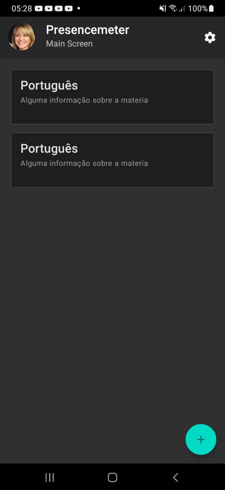
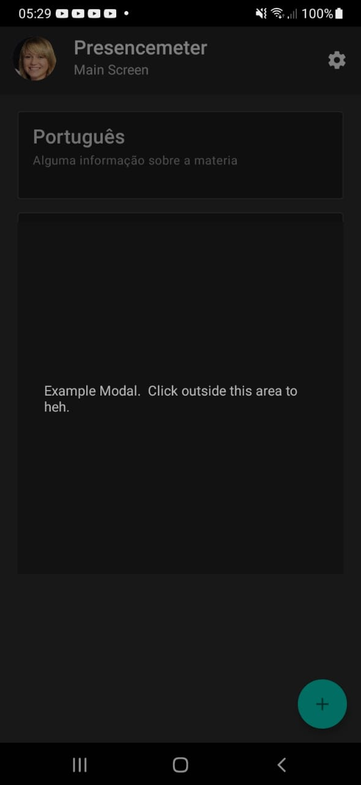

# Documentação do estado atual da versão react-native

## Instalar Coisas

1. seguir [esse guia](https://reactnative.dev/docs/environment-setup), com a aba 'React Native CLI Quickstart' selecionada
2. modificar o arquivo /android/local.properties com a localização correta do seu android sdk (talvez funcione se só apagar esse arquivo, mas vai que né)
3. rodar `npm install` deve instalar as dependencias, que são o react-native-paper e o react-navigation, mas caso não fucnione, apague o node_modules e instale manualmente:
    - [react-native-paper](https://callstack.github.io/react-native-paper/getting-started.html)
    - react-navigation: `npm install @react-navigation/native @react-navigation/stack @react-native-community/masked-view @react-navigation/drawer @react-navigation/material-bottom-tabs`

## Rodar

talvez já esteja claro como fazer pelo guia do react native, mas pra deixar documentado:

1. rodar `npx react-native start` pra deixar o metro rodando (que cuida por mudanças nos arquivos e tal)
2. instalar aplicativo no emulador/dispositivo rodando `npx react-native run-android` em outra aba/janela de terminal

## Aplicativo em si (atualmente)

É uma view geralzona, que tem um appbar, uma scrollview e um botão flutuante em baixo. Também tem um modal que inicialmente é invisivel. No appbar tem um avatar, o titulo, subtitulo e um botão de engrenagem no canto direito.
A scrollview é a view que permite scrollar caso fique a altura dela ficar maior que o tamanho da tela. Nela ficam os cards das matérias.
Quando o botão de baixo é clicado, cria um novo card.
Pra testar coloquei que o botão de engrenagem limpa a lista de matérias (deixa só uma)
Quando uma matéria é clicada, faz o modal ficar visivel, que por enquanto só tem texto placeholder.
O conteúdo do modal seria modificado com states.

Screenshot da tela principal:

Screenshot do modal:

## Usar Icones

pegar o nome do icone [nessa pagina](https://pictogrammers.github.io/@mdi/font/6.3.95/), só tirar o 'mdi-' do começo dos nomes dos icones